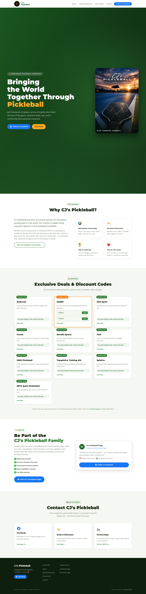

<div align="center">

# 🏓 CJ's Pickleball

**Bringing the World Together Through Pickleball**

[](https://cjspickleball.netlify.app)
[](https://developer.mozilla.org/en-US/docs/Web/HTML)
[](https://developer.mozilla.org/en-US/docs/Web/CSS)
[](https://developer.mozilla.org/en-US/docs/Web/JavaScript)

</div>

---



---

## Overview

A professional landing page for **CJ's Pickleball** — a global pickleball community and brand. Built with semantic HTML5, modern CSS, and vanilla JavaScript. No frameworks, no build tools, just clean performant code.

The site features exclusive discount codes, gear picks, community resources, and a Facebook community hub with tens of thousands of followers worldwide.

---

## Features

- **Responsive Design** — pixel-perfect on mobile, tablet, and desktop
- **Scroll Reveal Animations** — smooth entrance animations via Intersection Observer
- **Deals & Discounts Section** — curated partner codes updated in real-time
- **Community Hub** — links to the Facebook group and social channels
- **Strict CSP Headers** — security-hardened meta tags blocking inline injection
- **Optimized Performance** — no frameworks, no bundler, instant load times
- **Accessible Markup** — semantic HTML with ARIA labels throughout

---

## Tech Stack

| Layer | Technology |
|---|---|
| Markup | HTML5 (semantic) |
| Styling | CSS3 — Grid, Flexbox, custom properties |
| Interactivity | Vanilla JavaScript |
| Fonts | Google Fonts (Montserrat, Open Sans) |
| Hosting | Netlify |

---

## Getting Started

```bash
git clone https://github.com/coleyrockin/CJIIIPICKLEBALL.git
cd CJIIIPICKLEBALL
open index.html
```

Or run the local dev server:

```bash
./scripts/start-local.sh
```

---

## Project Structure

```
CJIIIPICKLEBALL/
├── css/
│   └── styles.css        # All styles — layout, animations, components
├── js/
│   └── main.js           # Nav toggle, scroll reveal, interactivity
├── images/               # Logos, hero photos, assets
├── scripts/
│   └── start-local.sh    # Local dev server
├── index.html            # Single-page entry point
└── LICENSE
```

---

## Deployment

Hosted on **Netlify** with continuous deployment from `main`.

**Live URL:** [https://cjspickleball.netlify.app](https://cjspickleball.netlify.app)

Push to `main` → Netlify auto-deploys. No build step required.

---

<div align="center">

Built by [Boyd Roberts](https://github.com/coleyrockin)

</div>
