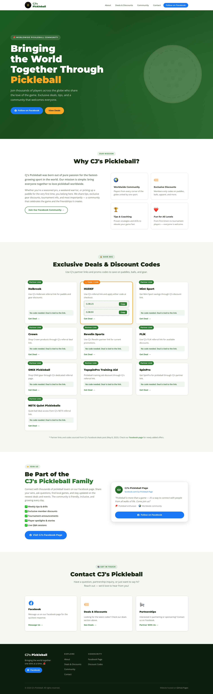
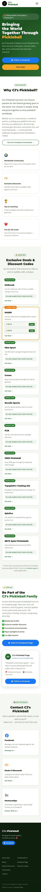

# CJ's Pickleball Website

This site was built for my dad's pickleball community to give his Facebook audience a professional home for:

1. CJ's story and community mission
2. Easy-to-use deal codes
3. A clean way for new players and partners to connect

📘 **Facebook:** [CJ's Pickleball Page](https://www.facebook.com/people/CJs-Pickleball-Page/100089379470047/)

---

## Site Preview

Desktop:



Mobile:



---

## Run Locally

```bash
bash scripts/start-local.sh
```

Then open `http://127.0.0.1:4173` in your browser.  
Stop with `Ctrl+C`.

---

## Current Discount Links (Updated February 24, 2026)

These offers were added from CJ's Facebook deals post (dated May 8, 2025):

1. Holbrook: `https://holbrookpickleball.com/cjroberts`
2. HUDEF: `https://hudefsport.com?sca_ref=4372136.7bZvbguDdl` (codes: `CJR15` or `CJR30`)
3. Mint Sport: `https://mintsport.com/discount/cjpickle`
4. Crown: `https://crownpickleball.store/cjroberts`
5. Revolin Sports: `https://rstr.co/revolin/6321`
6. FLiK: `https://flikpickleball.com/?ref=CJROBERTS&sub_id=`
7. ONIX Pickleball: `https://www.onixpickleball.com/cjpickle`
8. TopspinPro Training Aid: `https://topspinpro.com/pickleball-training-aid/ref/cjr`
9. SpinPro: `https://topspinpro.com/spinpro-for-pickleball/ref/cjr`
10. NETX Quiet Pickleballs: `https://netxbrand.com?sca_ref=9376042.qoX7azPHqpq`

Note: most offers are link-based. HUDEF currently has the explicit checkout codes.

---

## Updating Discount Codes

Edit the `<!-- ===== DISCOUNTS ===== -->` section in `index.html`.

```html
<span class="coupon-code" data-code="YOUR_CODE">YOUR_CODE</span>
<button class="copy-btn" data-target="YOUR_CODE">Copy</button>
```

---

## Project Structure

```
CJIIIPICKLEBALL/
├── index.html
├── css/styles.css
├── js/main.js
├── images/logo.png
├── scripts/start-local.sh
├── site-preview.png
└── site-preview-mobile.png
```
