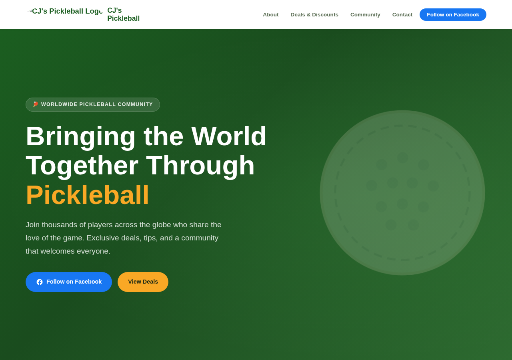

# CJ's Pickleball

Professional static website for **CJ's Pickleball** — bringing the world together to love pickleball.

🌐 **Live site:** [cjspickleball.com](https://cjspickleball.com)  
📘 **Facebook:** [CJ's Pickleball Page](https://www.facebook.com/people/CJs-Pickleball-Page/100089379470047/)



---

## Project Structure

```
CJIIIPICKLEBALL/
├── index.html        ← Main website (homepage)
├── css/
│   └── styles.css    ← All styles (responsive, mobile-first)
├── js/
│   └── main.js       ← Mobile nav, copy-to-clipboard, animations
├── images/           ← Place logo.png here (download from Facebook)
├── CNAME             ← Custom domain for GitHub Pages
└── .nojekyll         ← Disables Jekyll so GitHub Pages serves files as-is
```

---

## Hosting (GitHub Pages — Free)

This site is hosted on **GitHub Pages** — completely free, no server needed.

### Setup Steps

1. Go to your repository on GitHub.
2. Click **Settings → Pages**.
3. Under **Source**, select `Deploy from a branch`.
4. Choose branch `main` (or `master`) and folder `/ (root)`.
5. Click **Save**.

GitHub will publish your site at `https://<username>.github.io/CJIIIPICKLEBALL/`.

### Custom Domain (cjspickleball.com)

1. In your domain registrar (e.g., GoDaddy, Namecheap), add these DNS records:

   | Type  | Name | Value                    |
   |-------|------|--------------------------|
   | A     | @    | 185.199.108.153          |
   | A     | @    | 185.199.109.153          |
   | A     | @    | 185.199.110.153          |
   | A     | @    | 185.199.111.153          |
   | CNAME | www  | `<username>.github.io`   |

2. In GitHub → Settings → Pages → Custom domain, enter `cjspickleball.com` and enable **Enforce HTTPS**.

The `CNAME` file in this repo is already set to `cjspickleball.com`.

---

## Adding the Logo

1. Download your profile/cover photo from your Facebook page.
2. Save it as `images/logo.png` in this repository.
3. The `` in `index.html` will automatically display it in the navbar.
   If no image is found, the text "CJ's Pickleball" is shown as a fallback.

---

## Updating Discount Codes

Open `index.html` and find the `<!-- ===== DISCOUNTS ===== -->` section.  
Each deal card has a `data-code` attribute you can update with real partner codes:

```html
<span class="coupon-code" data-code="YOUR_CODE">YOUR_CODE</span>
<button class="copy-btn" data-target="YOUR_CODE">Copy</button>
```

Visitors click **Copy** and the code is instantly copied to their clipboard.

