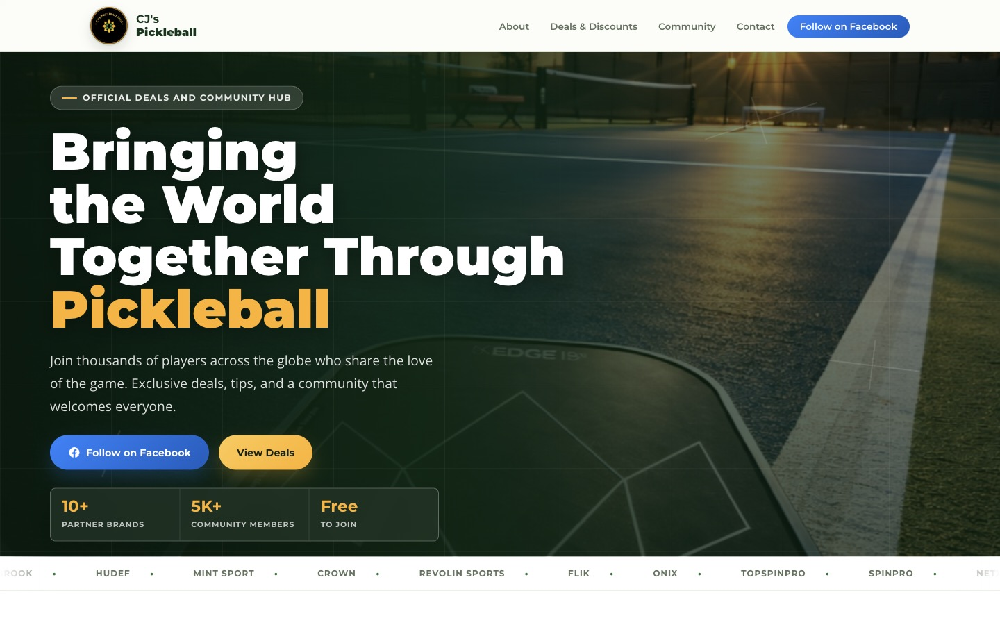

<div align="center">

# 🏓 CJ's Pickleball

**Bringing the World Together Through Pickleball**

[](https://cjspickleball.netlify.app)
[](https://developer.mozilla.org/en-US/docs/Web/HTML)
[](https://developer.mozilla.org/en-US/docs/Web/CSS)
[](https://developer.mozilla.org/en-US/docs/Web/JavaScript)
[](LICENSE)

</div>

---



---

## Overview

A polished, single-page landing site for **CJ's Pickleball** — a worldwide pickleball community sharing tips, exclusive partner discounts, and connection points with players around the globe.

Built with semantic HTML5, modern CSS, and vanilla JavaScript. **Zero frameworks, zero build step, zero runtime dependencies.** Just clean, performant, hand-crafted code.

🔗 **Live site:** [cjspickleball.netlify.app](https://cjspickleball.netlify.app)
📘 **Facebook:** [CJ's Pickleball Page](https://www.facebook.com/people/CJs-Pickleball-Page/100089379470047/)

---

## Highlights

- 🎨 **Distinctive hero** — full-bleed court photography, layered contrast, and animated court-line accents via the Web Animations API
- 📊 **Animated stats counter** — numbers count up as the section enters the viewport
- 🎢 **Partner marquee strip** — gentle, infinite scroll showcasing every brand
- 📈 **Scroll progress bar** — fixed top indicator that tracks page position
- 🎯 **Active section nav** — current section is highlighted in the navbar via IntersectionObserver
- 💸 **Copy-to-clipboard codes** — one-click coupon copy with a toast confirmation
- ⬆️ **Back-to-top button** — appears after scrolling, smooth-scrolls to the hero
- ✨ **Scroll-reveal animations** — staggered entrance for cards and sections
- ♿ **A11y-first** — skip link, semantic landmarks, ARIA labels, keyboard focus rings, `prefers-reduced-motion` honored across CSS and WAAPI animations
- 🛡️ **Hardened security headers** — Netlify `_headers` plus meta fallbacks for strict CSP, Permissions-Policy, `referrer=no-referrer`, and `upgrade-insecure-requests`
- ✅ **CI smoke checks** — verifies required files, JavaScript syntax, CSP JSON-LD hash freshness, safe external-link attributes, and local asset references
- 📱 **Truly responsive** — mobile-first breakpoints at 480 / 700 / 900 px, with a hamburger menu and stacked grids
- 🔍 **SEO-ready** — Open Graph, Twitter Card, JSON-LD organization schema, canonical link

---

## Tech Stack

| Layer | Technology |
|---|---|
| Markup | HTML5 (semantic landmarks, ARIA) |
| Styling | CSS3 — Grid, Flexbox, custom properties, `clamp()` |
| Interactivity | Vanilla JavaScript (IIFE, no globals) |
| Animation | CSS transitions + Web Animations API (WAAPI) |
| Fonts | Google Fonts — Montserrat, Open Sans |
| Hosting | Netlify (continuous deployment from `main`) |

---

## Getting Started

```bash
git clone https://github.com/coleyrockin/CJIIIPICKLEBALL.git
cd CJIIIPICKLEBALL
```

Open the file directly:

```bash
open index.html
```

Or run the local dev server (defaults to `http://127.0.0.1:4173`):

```bash
./scripts/start-local.sh
```

You can override the port and host:

```bash
./scripts/start-local.sh 8080 0.0.0.0
```

---

## Project Structure

```
CJIIIPICKLEBALL/
├── css/
│   └── styles.css          # All styles — tokens, layout, components, animations
├── js/
│   └── main.js             # Nav, copy-to-clipboard, scroll reveal, stats, back-to-top
├── images/                 # Logos and hero photography
│   ├── logo.png
│   ├── logo.svg
│   └── hero-court.jpg
├── docs/
│   └── screenshot.jpg      # Used for README + Open Graph preview
├── .github/workflows/
│   └── ci.yml              # Static smoke checks for pushes and pull requests
├── scripts/
│   └── start-local.sh      # Local dev server (python3 http.server)
├── index.html              # Single-page entry point
├── _headers                # Netlify response headers for security + caching
├── .nojekyll               # Disable Jekyll processing on static hosts
├── LICENSE                 # MIT
└── README.md
```

---

## Deployment

Hosted on **Netlify** with continuous deployment from `main`:

```
Push to main → Netlify auto-deploys → live in ~30s
```

No build step. The site is plain static files; Netlify serves them as-is. Custom security headers are declared in `_headers`, with compatible meta fallbacks in `index.html`.

To deploy your own fork, connect the repo in the Netlify dashboard and accept the default static-site settings.

---

## Browser Support

Tested on the latest two versions of Chrome, Safari, Firefox, and Edge.
Graceful degradation:

- No IntersectionObserver → all reveal animations fall back to visible.
- No `navigator.clipboard` → falls back to `document.execCommand('copy')`.
- `prefers-reduced-motion: reduce` → reveals, marquee, stats counter, and floating paddles all stop animating.

---

## License

[MIT](LICENSE) © Boyd Roberts

---

<div align="center">

Built with 🏓 by [Boyd Roberts](https://github.com/coleyrockin)

</div>
