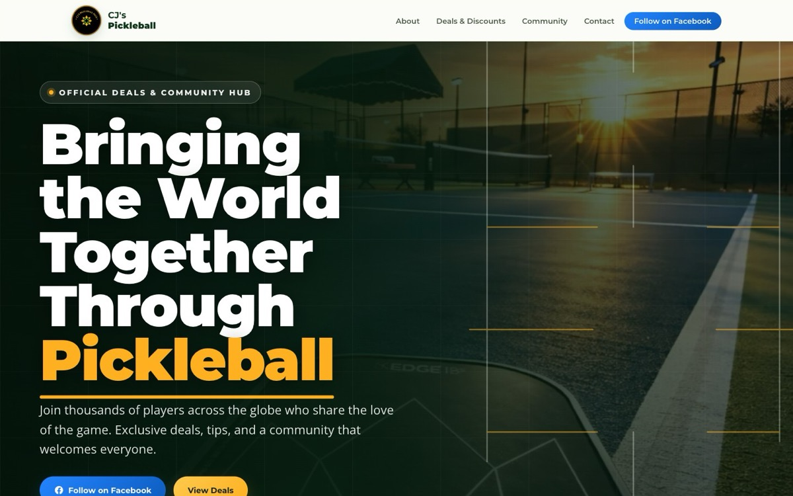

# CJ's Pickleball

A fast, hand-built landing page for CJ's Pickleball — a worldwide pickleball community that shares real partner discount codes and connects players around the globe.

[Live site](https://cjspickleball.netlify.app) · [Roadmap](ROADMAP.md) · [](https://github.com/coleyrockin/CJIIIPICKLEBALL/actions/workflows/ci.yml)



> The repo name **CJIII** is "CJ the third" — the site's for CJ Roberts III. Not a typo.

It does one job and does it well: get players to CJ's community and his real partner deals without a wasted byte. No framework, no build step, no tracking scripts, no cookie banner — just fast, accessible, honest static pages behind a hardened Content-Security-Policy. If you're a player, it's the shortest path to the codes. If you're a developer, it's a working reference for shipping a polished marketing site on pure HTML/CSS/JS.

## Installation

```bash
git clone https://github.com/coleyrockin/CJIIIPICKLEBALL.git
cd CJIIIPICKLEBALL
```

That's the whole install. Nothing to pull, nothing to build.

## Usage

Open it straight from disk:

```bash
open index.html
```

Or serve it locally (defaults to `http://127.0.0.1:4173`; pass a port and host to override):

```bash
./scripts/start-local.sh
./scripts/start-local.sh 8080 0.0.0.0
```

Deploying is just `git push`: Netlify watches `main` and publishes the static files as-is in about half a minute. Security and caching headers live in `_headers` (with meta fallbacks in `index.html`) — there's no build to configure.

## Tech Stack

- **HTML5 / CSS3 / vanilla JS** — semantic markup, CSS Grid + custom properties, one dependency-free IIFE. No framework, no bundler.
- **Animation** — CSS transitions plus the Web Animations API, all gated behind `prefers-reduced-motion`.
- **Fonts** — Montserrat + Open Sans, self-hosted as subsetted `woff2` (no Google Fonts request; `font-src 'self'` in the CSP).
- **Hosting** — Netlify, continuous deploy from `main`.
- **Security** — hash-pinned CSP + SRI and locked-down response headers, enforced in CI.

CSS is split across six files — `base · components · nav · hero · sections · responsive`, loaded in that order so responsive overrides win. `js/main.js` handles navigation, copy-to-clipboard, scroll reveals, and the stats counter.

## Contributing

PRs welcome. Keep it vanilla — no framework, no build step — and run the checks before you push:

```bash
node --check js/main.js              # JS parses
node scripts/check-csp-hashes.js     # CSP + SRI hashes in sync
```

One gotcha worth knowing up front: **the CSP is hash-pinned.** If you edit `js/main.js` or the inline JSON-LD block, its SHA-256 changes and the browser will silently refuse to load it — broken counter, dead nav, missing structured data. Recompute the hash in three places — the `<meta>` CSP in `index.html`, the CSP line in `_headers`, and the `integrity` attribute on the `main.js` `<script>` tag — then re-run the check script. It prints the exact hash to paste on drift, and CI runs the same check, so a stale hash fails the build rather than production.

See [ROADMAP.md](ROADMAP.md) for what's planned and what's deliberately out of scope.

## License

[MIT](LICENSE) © Boyd Roberts
